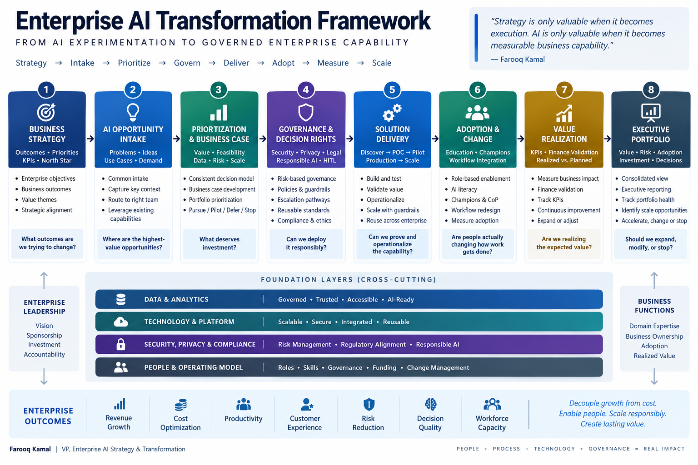

# 🧭 Enterprise AI Transformation

### From AI experimentation to governed enterprise capability

Enterprise AI transformation requires more than deploying AI tools. It requires an operating system that connects **business strategy, use-case demand, technology, governance, delivery, adoption, and measurable value**.

This framework provides a practical model for moving an organization from fragmented AI experimentation to a scalable enterprise capability.

---

## The Challenge

Organizations often begin their AI journey with significant enthusiasm but fragmented execution:

- AI initiatives emerge independently across business functions
- Use cases lack consistent prioritization
- Business value is difficult to quantify
- Governance occurs too late in the lifecycle
- POCs do not consistently graduate into production
- Technology decisions become fragmented
- Ownership and accountability are unclear
- Adoption is treated separately from solution delivery
- Executive leadership lacks a consolidated view of AI investment, risk, and realized value

The result can be **many AI activities without an enterprise AI capability**.

---

## Enterprise AI Transformation Architecture

The model connects eight enterprise capabilities:



```text
┌──────────────────────────────┐
│      BUSINESS STRATEGY       │
│ Outcomes • Priorities • KPIs │
└──────────────┬───────────────┘
               ↓
┌──────────────────────────────┐
│     AI OPPORTUNITY INTAKE    │
│ Problems • Ideas • Use Cases │
└──────────────┬───────────────┘
               ↓
┌──────────────────────────────┐
│ PRIORITIZATION & BUSINESS    │
│            CASE              │
│ Value • Feasibility • Risk   │
│ Data • Scale • Readiness     │
└──────────────┬───────────────┘
               ↓
┌──────────────────────────────┐
│ GOVERNANCE & DECISION RIGHTS │
│ Security • Privacy • Legal   │
│ Data • Responsible AI • HITL │
└──────────────┬───────────────┘
               ↓
┌──────────────────────────────┐
│      SOLUTION DELIVERY       │
│ Discover → POC → Pilot →     │
│ Production → Scale           │
└──────────────┬───────────────┘
               ↓
┌──────────────────────────────┐
│      ADOPTION & CHANGE       │
│ Education • Champions •      │
│ Workflow Integration         │
└──────────────┬───────────────┘
               ↓
┌──────────────────────────────┐
│      VALUE REALIZATION       │
│ KPIs • Finance Validation •  │
│ Realized vs. Planned Value   │
└──────────────┬───────────────┘
               ↓
┌──────────────────────────────┐
│   EXECUTIVE PORTFOLIO VIEW   │
│ Value • Risk • Adoption •    │
│ Investment • Decisions       │
└──────────────────────────────┘
