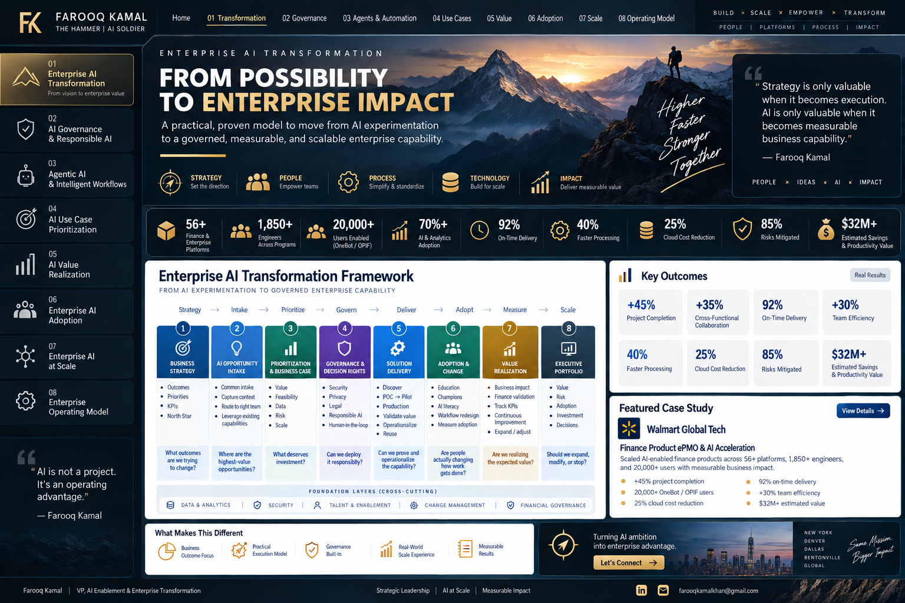

# 🧭 Enterprise AI Transformation

### From AI experimentation to governed enterprise capability

Enterprise AI transformation requires more than deploying AI tools. It requires an operating system connecting **business strategy, opportunity demand, technology, governance, delivery, adoption, and measurable value**.

> **Portfolio note:** This generalized leadership framework does not disclose confidential or proprietary employer information.

---

## The Executive Challenge

Organizations can generate significant AI activity without creating an enterprise AI capability. Common symptoms include fragmented initiatives, inconsistent prioritization, unclear ownership, governance introduced too late, POCs that stall before production, weak adoption, and limited visibility into realized value.

The objective is not simply **more AI**. It is a repeatable system for deciding **where AI matters, what deserves investment, how it can be deployed responsibly, and whether it creates measurable value**.

---

## Enterprise AI Transformation Architecture

| Stage | Executive Question | Core Outcome |
|---|---|---|
| **Business Strategy** | What outcomes are we trying to change? | Strategic alignment |
| **AI Opportunity Intake** | Where are the highest-value opportunities? | Structured demand |
| **Prioritization & Business Case** | What deserves investment? | Value/readiness decision |
| **Governance & Decision Rights** | Can we deploy it responsibly? | Proportional controls |
| **Solution Delivery** | Can we prove and operationalize it? | POC → Pilot → Production → Scale |
| **Adoption & Change** | Are people changing how work gets done? | Workflow integration |
| **Value Realization** | Are we realizing expected value? | Measured outcomes |
| **Executive Portfolio** | Expand, modify, accelerate or stop? | Investment decisions |

---

## Strategy → Execution → Value

1. **Anchor to business outcomes** rather than tools.
2. **Capture demand consistently** through a common AI front door.
3. **Prioritize objectively** across value, feasibility, data readiness, risk, scalability, and adoption readiness.
4. **Apply proportional governance** based on materiality and risk.
5. **Prove before scaling** with explicit POC, pilot, production, and stop criteria.
6. **Design adoption into delivery** rather than adding change management later.
7. **Validate realized value** against the approved business case.
8. **Manage AI as a portfolio** with executive visibility into value, risk, adoption, investment, and capacity.

---

## Executive Decision Model

A mature AI portfolio lets leaders answer five questions quickly: **Value, Readiness, Risk, Adoption, and Scale.** Together they create a common language for moving opportunities from **idea → decision → delivery → adoption → realized value**.

---

## Related Frameworks

[AI Governance](../02-ai-governance-responsible-ai/README.md) • [Agentic AI](../03-agentic-ai-intelligent-workflows/README.md) • [Prioritization](../04-ai-use-case-prioritization/README.md) • [Value Realization](../05-ai-value-realization/README.md) • [AI Adoption](../06-enterprise-ai-adoption/README.md)

[← Back to Portfolio Home](../README.md)
