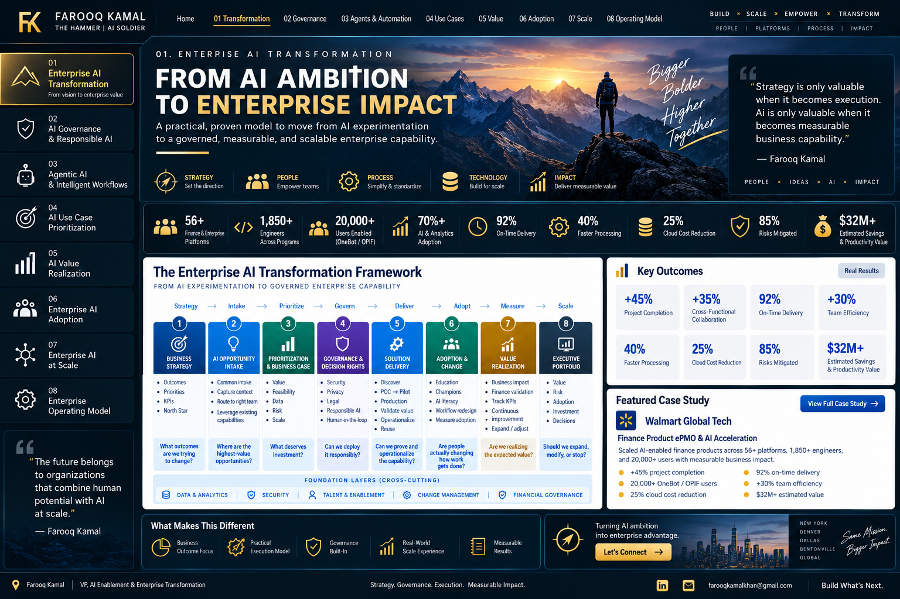

# 🛡️ AI Governance & Responsible AI

### Governance designed to enable responsible speed

Enterprise AI governance should not be a committee that appears at the end of delivery. It should create **clear decision rights, proportional controls, reusable standards, and fast escalation paths** throughout the AI lifecycle.

> **Portfolio note:** This generalized framework is designed for enterprise and regulated environments and does not disclose confidential employer policies or controls.

---

## Governance Principles

- **Risk-based, not one-size-fits-all:** controls scale with materiality, data sensitivity, autonomy, and business impact.
- **Govern early:** surface security, privacy, legal, compliance, data, and Responsible AI requirements before build decisions harden.
- **Keep humans accountable:** accountable business and technology owners remain explicit.
- **Separate guidance from material decisions:** routine questions move quickly; sensitive issues follow defined escalation paths.
- **Design for production:** ownership, monitoring, support, access, evaluation, and change control are part of readiness.

---

## Governance Architecture

| Layer | Purpose |
|---|---|
| **AI Front Door** | Early guidance, ideas, patterns and routing |
| **Structured Intake** | Outcome, users, data, integrations, actions and ownership |
| **Risk & Readiness Review** | Determine proportional controls and reviewers |
| **AI Leadership Decision** | Resolve material risk, policy or enterprise decisions |
| **Production Readiness** | Confirm controls, ownership, evaluation and support |
| **Ongoing Oversight** | Monitor performance, incidents, adoption, value and material change |

---

## Lightweight Go / No-Go

Before an AI capability advances, leaders should be able to answer: What outcome are we improving? Who owns it? What data and systems are involved? Can AI take actions? Where is human approval required? Who owns the capability after launch? What prevents production readiness? Does anything require executive escalation or risk acceptance?

---

## Decision Rights & Production Readiness

Routine guidance should remain accessible and fast. Material decisions move to the appropriate leadership forum when they involve significant data exposure, external/customer impact, regulated decisions, autonomous actions, policy exceptions, material financial/reputational risk, or enterprise-wide standards.

A production capability should have clear ownership, approved data access, security/privacy controls, defined human oversight, evaluation criteria, monitoring, incident/escalation procedures, change control, user enablement, and measurable business outcomes.

**Executive outcome:** governance that is **accessible at the edge and accountable at the center**—allowing AI to scale without losing control of risk, accountability, or value.

[← Back to Portfolio Home](../README.md)
