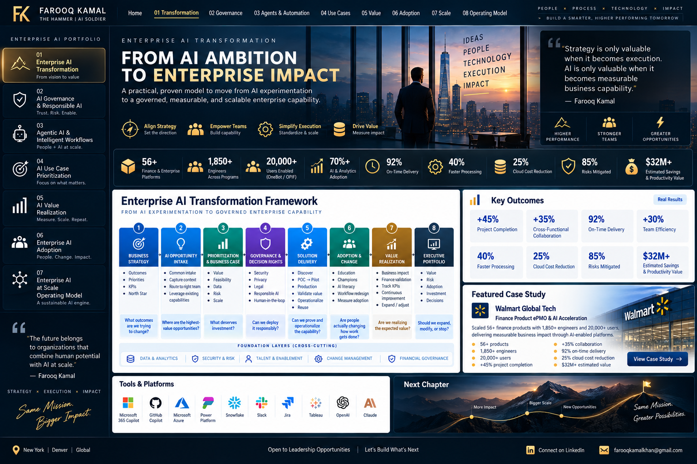

# 🤖 Agentic AI & Intelligent Workflows

### Moving from chat experiences to governed business capability

Agentic AI becomes valuable when it connects **knowledge, reasoning, tools, workflows, enterprise systems, and human accountability** around a defined business outcome. The model is not the product; the **operating workflow** is.

---

## Reference Architecture

**User / Business Event → Intelligent Front Door → Knowledge & Retrieval → Reasoning / Orchestration → Tools & Enterprise Systems → Human Oversight → Outcome + Telemetry**

Cross-cutting controls include **identity, permissions, security, privacy, evaluation, observability, Responsible AI, and change management**.

---

## Intelligent Intake Pattern

A high-value agent pattern is an **intelligent enterprise front door**. Instead of forcing employees to understand organizational structures, forms, queues, or systems, the agent captures the problem in natural language and determines what should happen next.

A strong intake agent can capture intent and context, retrieve approved knowledge, resolve common requests, route unresolved work, create structured workflow payloads, preserve context for human resolvers, identify recurring demand, and measure deflection, cycle time, quality, and user experience.

---

## Human + Agent Operating Model

| Pattern | Agent Role | Human Role |
|---|---|---|
| **Assist** | Retrieve, summarize, draft | Decide and act |
| **Recommend** | Analyze and propose | Review and approve |
| **Execute with approval** | Prepare and invoke workflow | Approve material action |
| **Execute within guardrails** | Complete bounded low-risk actions | Monitor exceptions |
| **Escalate** | Detect uncertainty or risk | Resolve judgment-intensive cases |

The goal is not maximum autonomy. It is the **right level of autonomy for the risk and business outcome**.

---

## Measures That Matter

Agent performance should be evaluated across **business outcome, quality, safety, adoption, and economics**. Depending on the workflow, measures can include deflection, cycle-time reduction, first-contact resolution, task completion, escalation rate, accuracy, user adoption, cost per resolution, and realized capacity.

[← Back to Portfolio Home](../README.md)
