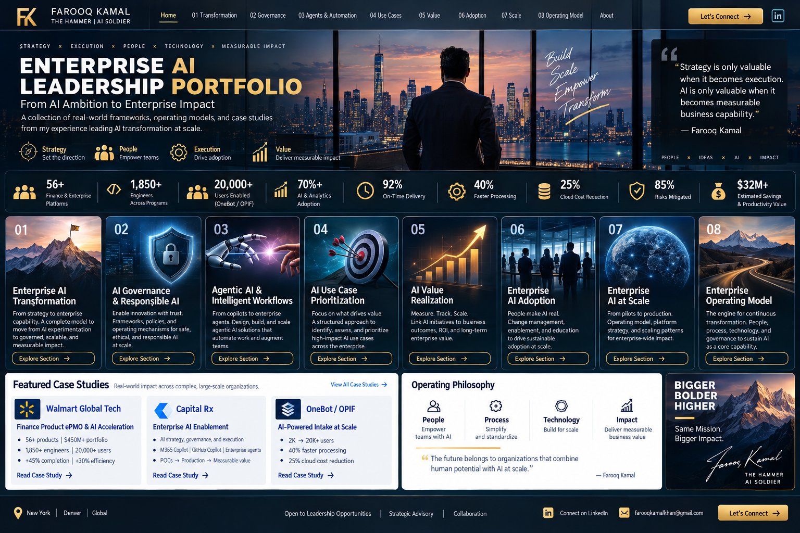

# 🎯 AI Use-Case Prioritization

### Converting AI demand into disciplined investment decisions

Enterprise AI portfolios need a common method for deciding which opportunities to **accelerate, pilot, prepare, defer, or stop**. The objective is not scoring for its own sake; it is a transparent decision process connecting business value with delivery reality.

---

## Decision Model

**Business Value × Feasibility × Data Readiness × Risk × Scalability × Adoption Readiness**

| Dimension | Executive Question |
|---|---|
| **Business Value** | Is there a meaningful financial, operational, customer, risk, or workforce outcome? |
| **Feasibility** | Can it be delivered with available technology, skills, integrations, and capacity? |
| **Data Readiness** | Is required data accessible, trusted, governed, and appropriate? |
| **Risk** | What security, privacy, legal, compliance, Responsible AI, or reputational exposure exists? |
| **Scalability** | Is this reusable across users, workflows, functions, or products? |
| **Adoption Readiness** | Is there a clear owner, workflow fit, user need, and change path? |

---

## Portfolio Decisions

- **Accelerate:** high-value, high-readiness opportunity suitable for near-term delivery.
- **Pilot:** promising opportunity where assumptions should be tested first.
- **Prepare:** valuable opportunity blocked by data, integration, ownership, policy, or capability dependencies.
- **Defer:** lower priority relative to enterprise capacity and strategy.
- **Stop / Redirect:** weak value, excessive risk, duplication, or poor solution fit.

---

## POC → Production Gates

A POC proves a hypothesis; it does not automatically earn production investment. Graduation should consider demonstrated user value, evaluation results, production architecture, data/control readiness, operating ownership, adoption, support, economics, and measurable success criteria.

**Idea → Assess → Decide → POC → Evidence → Pilot → Production Readiness → Scale**

The result is AI prioritization that functions as **enterprise portfolio management**, not a collection of disconnected project decisions.

[← Back to Portfolio Home](../README.md)
