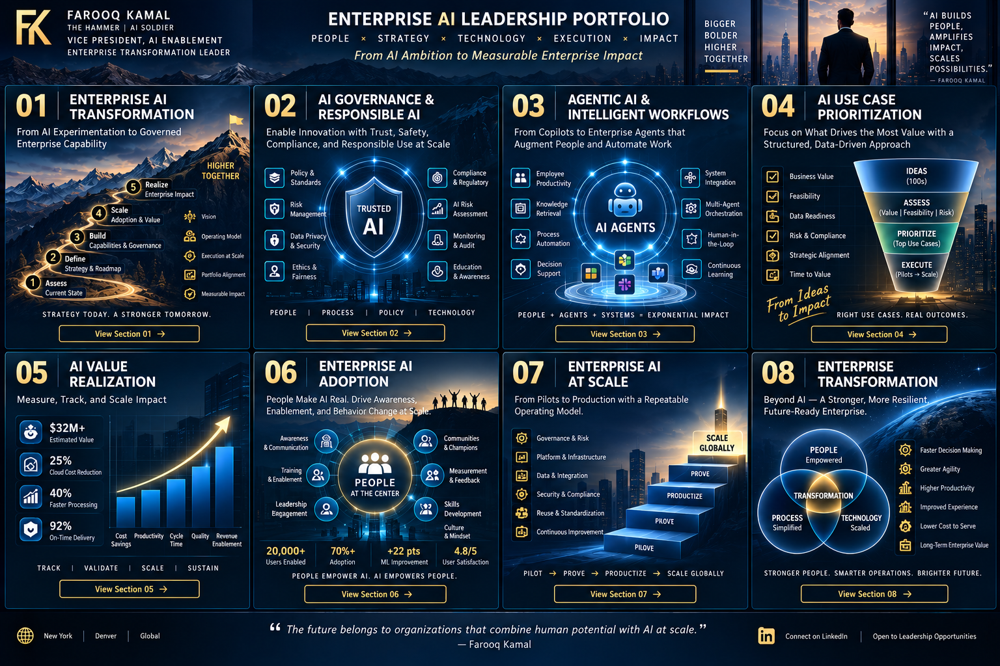

# 🚀 Enterprise AI Adoption

### Turning access to AI into sustained changes in how work gets done

Enterprise adoption is not a training campaign. It is a coordinated change system connecting **leadership, role-based capability, workflow redesign, champions, measurement, and reusable patterns**.

---

## Adoption Architecture

| Layer | Purpose |
|---|---|
| **Executive Sponsorship** | Establish why AI matters and reinforce accountable use |
| **AI Literacy** | Create a baseline for capabilities, limitations, risk and responsible use |
| **Role-Based Enablement** | Show how AI changes work specific to the role |
| **AI Champions** | Create local advocates, feedback loops and peer support |
| **Communities of Practice** | Share patterns, examples, lessons and reusable assets |
| **Workflow Redesign** | Embed AI into actual processes rather than adding another tool |
| **Measurement** | Track sustained use, workflow impact, quality and value |

---

## Adoption Journey

**Awareness → Access → First Use → Repeat Use → Workflow Integration → Measurable Impact → Advocacy**

A license does not create adoption, and adoption does not automatically create value. Different interventions are required at each stage.

---

## Role-Based Enablement + Champion Network

Generic prompting education is a useful foundation, but sustained adoption comes from showing employees how AI improves the work they already perform. Effective enablement combines foundational literacy with role-specific scenarios, approved patterns, live examples, guardrails, and measurable workflow outcomes.

Champions extend this model by discovering use cases, reinforcing safe practices, collecting friction, sharing reusable patterns, and creating **local relevance and scale**.

---

## Measures That Matter

A balanced view can include activation, active usage, repeat usage, role penetration, workflow integration, satisfaction, quality, cycle-time impact, reuse of approved patterns, and realized business outcomes.

The executive question is not **“How many people used AI?”** but **“Where did AI materially improve how work gets done?”**

[← Back to Portfolio Home](../README.md)
