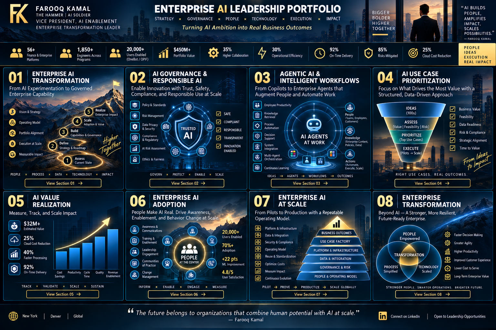

# ⚡ Enterprise AI at Scale

### Selected leadership case studies

These case studies illustrate experience scaling AI, machine learning, conversational systems, and AI-ready data capabilities across large enterprise environments. They are intentionally presented at an outcome and leadership level and exclude confidential architecture, source code, proprietary data, and employer-sensitive information.

---

## Enterprise GenAI Capability

**Leadership focus:** Connected business use cases, platform strategy, adoption, operating mechanisms, and measurable outcomes across a large technology portfolio.

**Selected outcomes:** **15,000+ users**, **70%+ active monthly adoption within 90 days**, approximately **75% faster case summarization**, and approximately **60% faster tax research**.

**Leadership lesson:** Enterprise GenAI value comes from combining the model with trusted knowledge, workflow integration, adoption, and outcome measurement.

---

## Conversational AI & Intelligent Intake

**Leadership focus:** Helped scale conversational intake and support using NLP, intent modeling, workflow automation, and Jira integration.

**Selected outcomes:** **20,000+ users**, approximately **40% faster support resolution**, and more than **30 hours/week** of manual workload reduced.

**Leadership lesson:** High-value conversational experiences understand intent, retrieve trusted knowledge, route work, preserve context, and improve the underlying operating model.

---

## ML Decision Intelligence

**Leadership focus:** Supported machine-learning forecasting across **12 global business units**, connecting data readiness, adoption, and decision processes.

**Selected outcomes:** **18–22 percentage-point** improvement in forecast accuracy and business decisions approximately **2–3 weeks earlier**.

**Leadership lesson:** Predictive capability creates value when the output changes a decision—not merely when the model produces a better prediction.

---

## AI-Ready Data Foundations

**Leadership focus:** Advanced data catalog, lineage, quality scoring, role-based access, master-data practices, and self-service analytics.

**Selected outcomes:** approximately **20% less data sourcing/preparation effort**, **40% higher analytics delivery**, **20% better data-management efficiency**, and **35% lower remediation effort**.

---

## Scale Pattern

**Business Outcome → Data & Technology Foundation → Governed Delivery → Adoption → Measurement → Scale**

[← Back to Portfolio Home](../README.md)
