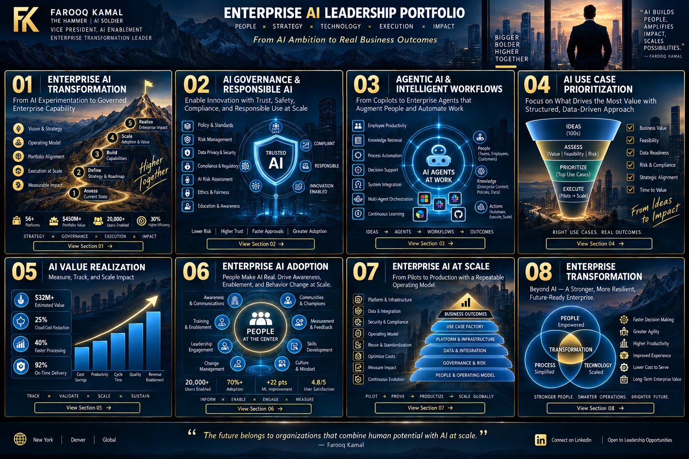

# 🏢 Enterprise Transformation

### Leadership across technology, corporate functions, data, and regulated environments

My transformation experience spans enterprise technology portfolios, Finance and Corporate Functions, data and analytics, AI, operating-model redesign, and regulated financial-services environments.

---

## $450M+ Enterprise Technology Portfolio

At Walmart Global Tech, I led enterprise portfolio governance across a **$450M+ technology portfolio spanning 56 Finance platforms**, with an ecosystem of **1,800+ technology associates, 162 product owners, 76 scrum teams, and 18 TPMs** supporting Walmart U.S., Sam's Club, and international Finance.

The leadership challenge was creating mechanisms for **investment prioritization, executive alignment, risk management, cross-platform dependencies, value realization, and transformation** across a complex global ecosystem.

---

## Corporate Functions Transformation

Transformation scope included Finance, enterprise performance management, planning, procurement, tax, reporting, automation, and asset-management capabilities.

**Selected outcomes:** OneStream consolidation helped rationalize **5+ legacy planning systems** and reduce the monthly close cycle by approximately **25%**. Strategic vendor negotiations generated more than **$32M in savings**.

---

## Data & Analytics Transformation

Leadership work connected catalog, lineage, quality, access, master-data practices, self-service analytics, forecasting, and AI readiness—creating foundations for faster analytics delivery and scalable AI capabilities.

---

## Regulated Technology Transformation

Earlier leadership roles across **Wells Fargo, Fannie Mae, JPMorgan Chase, and Bank of America** built experience operating where technology change must coexist with regulatory obligations, executive scrutiny, risk management, operational continuity, and large-scale stakeholder alignment.

Scope included cross-LOB modernization and executive transformation governance; investor reporting and servicer-data modernization; Dodd-Frank, HUD/HAMP, UAT and loan-servicing transformation; and high-volume risk operations.

---

## Leadership Pattern

**Create clarity → Establish decision rights → Align investment → Build execution mechanisms → Remove barriers → Measure outcomes → Scale what works**

The technology changes. The executive challenge remains the same: turning strategy into durable enterprise capability.

[← Back to Portfolio Home](../README.md)
