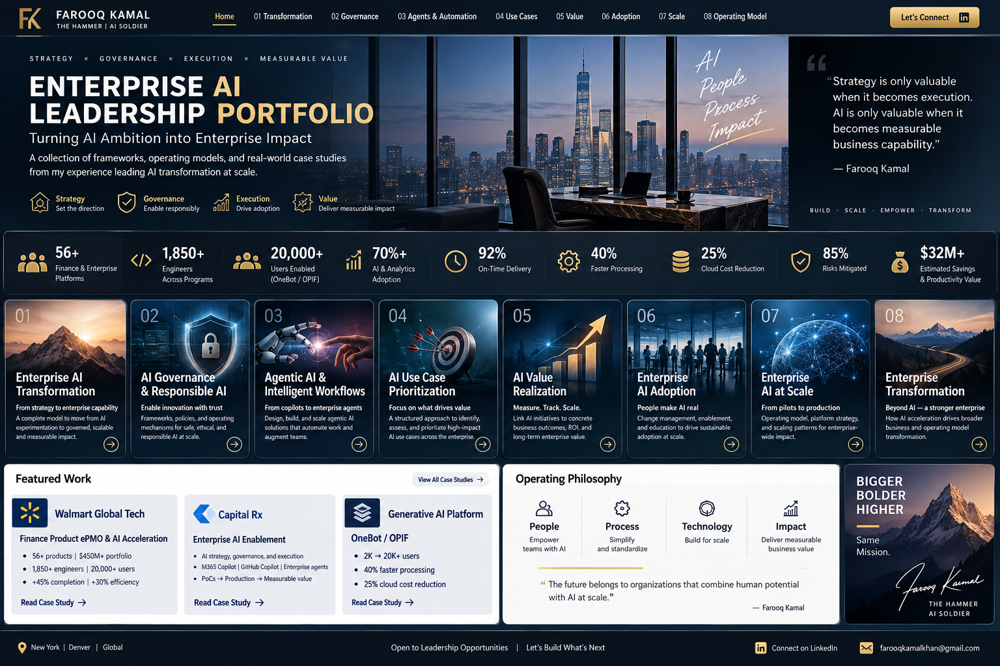

# Enterprise AI Leadership Portfolio

## Farooq Kamal
### VP, AI Enablement | Enterprise AI Transformation

**Enterprise AI Strategy → Governance → Agentic AI → Adoption → Value Realization → Enterprise Transformation**

I am an enterprise AI and digital transformation executive focused on turning emerging technology into **governed, scalable business capability with measurable value**.

My experience spans healthcare technology/PBM, global retail technology, and regulated financial services. I currently lead enterprise AI enablement and transformation at **Judi Health / Capital Rx**, and previously led enterprise technology portfolio governance and AI/data transformation at **Walmart Global Tech**.

> **Leadership philosophy:** Strategy is only valuable when it becomes execution. AI is only valuable when it becomes measurable business capability.

---

## Executive Snapshot

| Scope / Impact | Selected Experience |
|---|---|
| **$450M+** | Enterprise technology portfolio governed |
| **56 platforms** | Finance technology portfolio at global scale |
| **20,000+ users** | AI-enabled capabilities scaled across the enterprise |
| **70%+ adoption** | Active monthly adoption within 90 days for scaled GenAI |
| **18–22 pts** | ML forecasting accuracy improvement |
| **$32M+** | Vendor savings through strategic negotiations |
| **20 years** | Enterprise technology, transformation, operations and regulated-environment leadership |

---

# Part I — How I Lead

### [01 — 🧭 Enterprise AI Transformation](01-enterprise-ai-transformation/README.md)
A strategy-to-value operating system for moving organizations from fragmented AI experimentation to governed enterprise capability.

### [02 — 🛡️ AI Governance & Responsible AI](02-ai-governance-responsible-ai/README.md)
Risk-based governance, decision rights, human accountability, production readiness, and executive escalation.

### [03 — 🤖 Agentic AI & Intelligent Workflows](03-agentic-ai-intelligent-workflows/README.md)
Patterns connecting agents with trusted knowledge, reasoning, enterprise systems, workflows, human oversight, and measurable outcomes.

### [04 — 🎯 AI Use-Case Prioritization](04-ai-use-case-prioritization/README.md)
A portfolio decision model for determining what to **accelerate, pilot, prepare, defer, or stop**.

### [05 — 💰 AI Value Realization](05-ai-value-realization/README.md)
Business ownership, Finance validation, executive sponsorship, KPI measurement, and planned-versus-realized value reporting.

### [06 — 🚀 Enterprise AI Adoption](06-enterprise-ai-adoption/README.md)
A change architecture connecting literacy, role-based enablement, champions, workflow redesign, sustained adoption, and measurable impact.

---

# Part II — What I've Delivered

### [07 — ⚡ Enterprise AI at Scale](07-enterprise-ai-at-scale/README.md)
Selected AI case studies spanning GenAI, conversational AI, ML decision intelligence, and AI-ready data foundations—with capabilities scaled to **20,000+ users**.

### [08 — 🏢 Walmart Global Tech | Enterprise Transformation](08-walmart-global-tech/README.md)
A **$450M+ / 56-platform** transformation portfolio spanning AI, data, Finance platforms, global planning, compliance, automation, governance, and operational intelligence.

### [09 — 🏦 Wells Fargo | Digital Wealth Transformation](09-wells-fargo-digital-wealth/README.md)
Digital advisory transformation integrating four wealth and trust lines of business across product, technology, operations, Risk, Compliance, and Legal.

### [10 — 🏠 Fannie Mae | Investor Reporting Modernization](10-fannie-mae-investor-reporting/README.md)
Modernization of legacy servicer reporting into governed, automated, system-driven investor reporting across a large external servicing ecosystem.

### [11 — 🏛️ JPMorgan Chase | Regulated Technology Transformation](11-jpmorgan-regulated-transformation/README.md)
Federal policy-driven decisioning, servicing-platform migration, acquisition integration, regulated customer communications, Dodd-Frank/HUD releases, and nationwide workflow delivery.

### [12 — ☎️ Bank of America | Operations & Contact Center Transformation](12-bank-of-america-contact-center/README.md)
Frontline workflow redesign, contact-center operations, quality, workforce management, escalation governance, compliance, and the operating foundation for modern AI-enabled service transformation.

---

## The Career Through-Line

**Regulated Operations → Enterprise Platforms → Data & Analytics → Machine Learning → GenAI → Agentic AI → Enterprise AI Strategy & Governance**

The technology evolved across my career, but the executive problem remained consistent: **turn complexity into an operating model, align leaders around decisions, build scalable capability, manage risk, drive adoption, and prove measurable value.**

---

## How I Lead Transformation

**Business Strategy → Portfolio & Investment Priorities → Operating Model + Decision Rights → Data + Technology + AI → Governed Delivery → Adoption + Workflow Change → Measurable Value → Executive Portfolio Decisions**

My work sits at the intersection of **business strategy, AI, technology, data, governance, portfolio leadership, adoption, and value realization**. The objective is to create enough structure to scale—without creating bureaucracy that slows the enterprise down.

---

## Leadership Experience

**Judi Health / Capital Rx** — Vice President, AI Enablement | Enterprise AI Transformation  
Enterprise AI strategy, operating model, governance, portfolio prioritization, adoption, workforce transformation, production readiness, value realization, and executive reporting.

**Walmart Global Tech** — Director, Finance Product ePMO & Chief of Staff  
Enterprise technology portfolio governance, Corporate Functions transformation, AI/GenAI, machine learning, conversational AI, data and analytics, vendor strategy, and global executive alignment.

**Wells Fargo • Fannie Mae • JPMorgan Chase • Bank of America**  
Digital transformation, platform modernization, regulated decisioning, operations, risk, testing, and executive governance.

---

## Connect

- **LinkedIn:** [linkedin.com/in/farooqkamalkhan](https://www.linkedin.com/in/farooqkamalkhan/)
- **GitHub:** [github.com/farooqkamalkhan](https://github.com/farooqkamalkhan)

---

### About this portfolio

The frameworks and case studies here are presented as generalized leadership models and public professional experience. They intentionally exclude confidential, proprietary, security-sensitive, customer-specific, or employer-internal information.
